# Comparação das estruturas de árvore

[]()
[](https://www.sublimetext.com)


Elaborar arquivos que contenham 500, 5000, 50.000, 500.000 entradas numéricas do tipo ponto flutuante. Para tanto, tente evitar repetições de valores em grande escala para que possamos ter uma estrutura profunda. Considere produzir os menores a partir dos maiores volumes de forma randômica. Feito a isso, vamos testar os seguintes processos: 
<ol>
  <li>Qual o tempo gasto com pesquisa para um arquivo de entrada com 10.000 consultas. Considere como consulta a busca de um determinado número na estrutura escolhida. Para cada pesquisa, é preciso remover o elemento da árvore, retornando esse número para o usuário. Então, considere o processo de remoção como parte final do processo. </li>
  <li>Qual o tempo necessário para montar a estrutura em memória.</li>
  <li>Qual o ganho dessas estruturas ao compará-las a vetores ordenados e aplicados à pesquisa binária. Qual o tempo gasto com a ordenação do vetor? Foi possível produzi-lo em memória?</li>
  <li>Adotando como estrutura o map e unorder_map do C++, há ganhos maiores nesse processo de pesquisa?</li>
</ol>

## Conteúdo do README

<p align="center">
 <a href="#estruturas">Estruturas</a> •
 <a href="#árvore-binária-de-pesquisa">Árvore binária de pesquisa</a> •
 <a href="#árvore-avl">Árvore AVL</a> •
 <a href="#árvore-rubronegra">Árvore rubronegra</a> •
 <a href="#funcionamento-da-aplicação">Funcionamento da aplicação</a> •
 <a href="#resultados">Resultados</a> •
 <a href="#conclusão">Conclusão</a> •
 <a href="#configuração-utilizada">Configuração utilizada</a> •
 <a href="#compila%C3%A7%C3%A3o-e-execu%C3%A7%C3%A3o">Compilação e execução</a> •
 <a href="#contatos">Contatos</a>
</p> 

## Estruturas

Neste tópico, será abordado a explicação sobre o funcionamento das estruturas usadas para comparação.

### Árvore binária de pesquisa

A árvore binária de pesquisa é uma estrutura muito eficiente para armazenar informações. Sua estrutura é adequada para situações quando há necessidade de considerar todos ou alguma combinação dos itens a seguir:

<ul>
  <li>Acesso direto e sequencial eficiente</li>
  <li>Facilidade de inserção e retirada de registros</li>
  <li>Boa taxa de utilização de memória</li>
  <li>Utilização de memória primária e secundária</li>
</ul>

A estrutura básica da árvore de pesquisa binária é formada por uma raiz R com seus filhos esquerdo e direito, onde todos os elementos menores ficam na subárvore esquerda e todos os elementos maiores ficam na subárvore direita. Exemplo:

<p align="center">
  
</p>

A árvore binária de pesquisa possue as seguintes características para sua implementação:

<ul>
  <li>O nível da raiz sempre é 0.</li>
  <li>Se um nó está no nível <i>i</i>, então, a raiz de suas subárvores esquerda e direita estão no nível <i>i + 1.</i></li>
  <li>A altura de um nó é o comprimento do caminho mais longo deste nó até um nó folha.</li>
  <li>A altura de uma árvore é a altura do seu nó raiz até a folha mais distânte da estrutura.</li>
  <li>O número de filhos de um nó denomina-se grau, com nós de grau zero chamados de folhas.</li>
</ul>

Pseudocódigo da estrutura básica de uma árvore binária de pesquisa:

```
Record
  key: type of key;
  value: type of value;
  {other informations}
end;
No
  reg: Record;
  left, right : No;
end;
```

Procedimento de pesquisa aplicável a árvore binária:

<ol>
  <li>Verificar se a árvore é diferente de <strong>null</strong>.</li>
  <li>Compare com a chave que está na raiz.</li>
  <li>Se a chave for menor, vá para a subárvore esquerda.</li>
  <li>Se a chave for maior, vá para a subárvore direita.</li>
  <li>Repita o processo recursivamente até que a chave procurada seja encontrada ou um nó folha seja atingido.</li>
</ol>

Pseudocódigo do método de pesquisa na árvore binária:

```
input : k → Investigated key
input : p → No
output: record in binary search tree

if p == null:
  print(’[Error]: Record does not present in the tree’)
  
else if k < p.reg.key:
  BinarySearch(k, p.left)
  
else if k > p.reg.key:
  BinarySearch(k, p.right)
  
else:
  return p.reg;
```

O procedimento para inserção de novos elementos na árvore leva em consideração as ações executadas pelo método de pesquisa. As condições a serem levadas em consideração para a derivação do método de pesquisa são:

<ul>
  <li>Se a árvore for <strong>null</strong>, então insira o elemento na raiz e faça os filhos esquerdo e direito iguais a <strong>null</strong>.</li>
  <li>Caso contrário, gere recursivamente chamadas ao método até que uma posição <strong>null</strong> seja alcançada. É nessa posição encontrada que o novo registro será inserido.</li>
</ul>

Pseudocódigo do método de inserção na árvore binária:

```
input : reg → record to save
input : p → No
output: binary search tree with the new record

if p == null:
  new(p);
  p.left = null;
  p.right = null;
  p.reg = reg;

else if reg.key < p.reg.key:
  Insert(reg, p.left)

else if reg.key > p.reg.key:
  Insert(reg, p.right)

else:
  print(’[Error]: Record is already presents!’);
```

<strong>Observação:</strong> Como estamos trabalhando com ponteiro é de extrema importância que não nos esqueçamos de iniciar nossa árvore. Caso isso não aconteça, um erro será gerado ao tentar realizar qualquer operação com a mesma.

Pseudocódigo do procedimento de inicialização:

```
input : root → start pointer of the tree
output: binary search tree initialized
root = null;
```

O método de remoção não é trivial. Considerando R como o nó a ser removido, então:

<ol>
  <li>Se R não tem filhos, então basta eliminá-lo.</li>
  <li>Se R tem um único filho, seu pai apontar para esse filho e elimine R.</li>
  <li>Se R tem dois filhos, substitua:
    <ul>
      <li>Pelo registro mais a direita da subárvore esquerda.</li>
      <li>Pelo registro mais a esquerda da subárvore direita.</li>
    </ul>
  </li>
</ol>

Para que o procedimento de remoção funcione corretamente, precisamos implementar dois estágios de operação, sendo eles <i>Retira</i> e <i>Antecessor</i>.

Pseudocódigo do procedimento predecessor:

```
input : root → start pointer of the tree
input : p → pointer in the tree
output: a pointer with predecessor

if root.right != null:
  predecessor(p, root.right)

else:
  p.reg = root.reg;
  p = root;
  root = root.left;
  dispose(p);
```

Pseudocódigo do procedimento de remoção:

```
input : t → start pointer of the tree
input : reg → record to remove
output: binary search tree without the record

if t == null:
  print(’[Error]: The searched record is not in the binary tree’)

if reg.key < t.reg.key:
  Remove(reg, t.left)

if reg.key > t.reg.key:
  Remove(reg, t.right)

if t.right == null
  aux = t;
  t = t.left;
  dispose(aux);

if t.left != null:
  predecessor(t, t.left);
  
aux = t;
t = t.right;
dispose(aux);
```

Quanto à análise de custo computacional da árvore binária de pesquisa, para uma pesquisa bem sucedida, temos:

<ul>
  <li><strong>Melhor caso:</strong> <i>O(1)</i></li>
  <li><strong>Pior caso:</strong> <i>O(n)</i></li>
  <li><strong>Caso médio:</strong> <i>O(log n)</i></li>
</ul>

Como pode ser observado, o tempo de execução depende muito da forma como o conjunto de dados está armazenado. Para o pior caso basta que os dados estejam ordenados de forma crescente ou decrescente. Nesses casos, o custo médio para se
encontrar um elemento é equivalente ao custo do método de pesquisa sequencial, ou seja, $$O(\frac{n+1}{2})$$


### Árvore AVL

As árvores binárias de pesquisa têm uma grave desvantagem que pode afetar seu desempenho. Essa desvantagem está ligada diretamente com o conjunto de dados, seu desempenho pode ser afetado pela forma com que o conjunto é apresentado para o método de inserção da árvore.

Para resolver esse problema precisamos gerar o que chamamos de balanceamento da árvore. Exemplo:

<p align="center">
  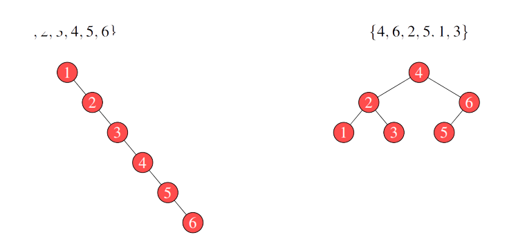
</p>

Para evitar o problema descrito anteriormente aplicamos um novo conceito na estrutura da árvore binária, o balanceamento. 

Uma generalização da árvore binária, no entanto, balanceada é a árvore AVL (Adelson Velsky e Landis). O objetivo da técnica proposta na AVL está em manter as subárvores esquerda e direita com altura aproximada. Este fato nos permite avaliar sua altura em <i>log n</i>. Para garantir o balanceamento, a AVL calcula o desequilíbrio a partir da profundidade (nível) do nó mais distante de cada subárvore. Caso esse se encontre com um índice de desbalanceamento maior ou igual a 2, a árvore é recomposta por rotações.

As técnicas para balanceamento são as seguintes:

<ul>
  <li>Para todo nó, as alturas de suas subárvores (direira e esquerda) devem diferenciar no máximo em uma unidade de altura.</li>
  <li>Garantindo o balanceamento, as consultas, inserções e remoções apresentarão custo em <i>O(log n)</i>.</li>
</ul>

<p align="center">
  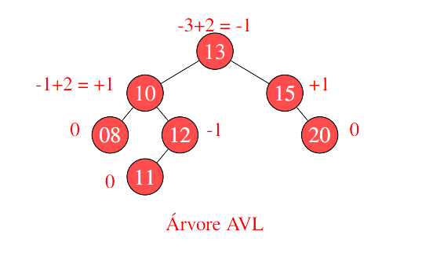
</p>

Para se obter o balanceamento em uma AVL, o primeiro passo é calcular o fator de balanceamento para cada nó. Os passos para obter o fator de balanceamento são:

<ol>
  <li>Comece atribuindo zero para todo nó folha da árvore.</li>
  <li>Suba um nível e some a subárvore a direita e subárvore esquerda.</li>
  <li>Verifique se o resultado do calculo excede em uma unidade. Se exceder, a árvore estará desbalanceada e deve ser recomposta.</li>
</ol>

Por questões de eficiência, o valor obtido do balanceamento, para cada nível processado, é armazenado junto aos dados de cada nó, sendo esse atualizado a cada operação.

Todo processo de remoção em uma árvore AVL gera como resultado uma árvore balanceada como retorno. Logo, é preciso verificar a cada remoção a necessidade de se executar tal procedimento.

As operações de remoção e inserção podem causar desbalanceamento na estrutura da árvore. Logo, é preciso executar operações sob essa estrutura para balancear novamente o conjunto de dados.

<ul>
  <li>A recuperação do balanceamento é realizado por operações chamadas de rotações.</li>
  <li>As rotações podem ser divididas em 4 configurações:
    <ol>
      <li>Rotação simples à esquerda.</li>
      <li>Rotação simples à direita.</li>
      <li>Rotação dupla à esquerda.</li>
      <li>Rotação dupla à direira.</li>
    </ol>
  </li>
</ul>

Pseudocódigo da rotação simples à direita:

```
input : t → root of the Tree
output: Balanced Tree
aux = t.left;
t.left = aux.right;
aux.right = t;
t.peso = MaxWeight(getWeight(t.left), getWeight(t.right)) + 1;
aux.peso = MaxWeight(getWeight(aux.left), t.peso) + 1;
t = aux;
```

Pseudocódigo da rotação simples à esquerda:

```
input : t → root of the Tree
output: Balanced Tree
aux = t.right;
t.right = aux.left;
aux.left = t;
t.peso = MaxWeight(getWeight(raizˆ .esquerdo), getWeight(raizˆ .direito)) + 1;
aux.peso := MaxWeight(getWeight(auxˆ .direito), raizˆ .peso) + 1;
raiz = aux;
```

Pseudocódigo da rotação dupla esquerda/direita:

```
input : t → root of the Tree
output: Balanced Tree
rotacaoSimplesEsquerda(t.left);
rotacaoSimplesDireita(t);
```

Pseudocódigo da rotação dupla direita/esquerda:

```
input : t → root of the Tree
output: Balanced Tree
rotacaoSimplesDireita(t.right);
rotacaoSimplesEsquerda(t);
```

Pseudocódigo da inserção:

```
input : t → root of the tree
input : item → new item
output: Tree with the new item inserted

if (t == NULL):
  new(t);
  t.item = item;
  t.weight = 0;
  t.left := NULL;
  t.right = NULL;

else if (item.key < t.item.key):
  inserir(item, t.left);

  if ((getWeight(t.left) - getWeight(t.right)) = 2):
    if (item.key < t.left.item.key):
      rotacaoSimplesDireita(t)
    else
      rotacaoDuplaEsquerdaDireita(t);
else if (item.key > t.item.key):
  inserir(item, t.right);

  if ((getWeight(t.right) - getWeight(t.left)) = 2):
    if (item.key > t.right.item.key):
      rotacaoSimplesEsquerda(t)
    else
      rotacaoDuplaDireitaEsquerda(t);
t.weight := MaxWeight(getWeight(t.left), getWeight(t.right)) + 1;
```

Concluindo, temos que:

<ul>
  <li>O balanceamento da árvore binária reduz o número médio de comparações necessárias para localizar qualquer elemento da árvore.</li>
  <li>As operações de inserção e remoção tendem a deixar a árvore desbalanceada. Assim, tem-se um custo adicional nesses passos para validar sempre o balanceamento.
</li>
  <li>Essa estrutura é uma boa opção quando os dados armazenados são requisitados muitas vezes após sua inserção na árvore.
</li>
</ul>


### Árvore rubronegra

Essas árvores apresentam, dentre suas características positivas, o equilíbrio do custo relacionado a altura da árvore, apresentando custo em torno de <i>O(log n)</i> para a suas operações.

Ao restringir suas inserções e remoções pela coloração de seus nós, a árvore rubronegra garante que nenhum de seus caminhos terá comprimento maior que duas vezes (2x) o comprimento de qualquer outro caminho existente na árvore. Este fator faz com que esse modelo de estrutura seja aproximadamente balanceada.

As propriedades desta árvore são:

<ol>
  <li>Todo nó é vermelho ou preto.</li>
  <li>A raiz é sempre preta, mesmo sendo o único nó.</li>
  <li>Todo nó folha define seus filhos em nill como sendo pretos.</li>
  <li>Se um nó é vermelho, então ambos os vizinhos são pretos.</li>
  <li>Para todo nó, todos os caminhos até as folhas apresentam o mesmo número de nós pretos.</li>
  <li>Para cada nova inserção, o nó criado começa com a cor vermelha.</li>
</ol>

Para representar a estrutura necessária para a manipulação dessa árvore vamos precisar das seguintes declarações:

<ul>
  <li>Uma variável para representar o conteúdo do nó.</li>
  <li>Dois ponteiros, um para o filho esquerdo e outro para o direito.</li>
  <li>Um bit para representar a cor (vermelho ou preto).</li>
  <li>Um ponteiro para o pai. Isso facilita a manipulação da árvore e o balanceamento por meio das cores.</li>
</ul>

Pseudocódigo do conteúdo de cada nó:

```
Item:
  conteudo : type;
```

Pseudocódigo do estrutura para cada nó:

```
Node:
  reg : Item;
  *esquerdo : Node;
  *direito : Node;
  *pai : Node;
  cor : boolean;
```

A operação de inserção pode ser realizada em uma árvore vermelho e preta em tempo de O(log n). Os passos para executar essa operação são: 

<ol>
  <li>Faça uso do método de inserção da árvore binária para inserir um novo nó x na árvore t e deixe-o com a cor vermelha.</li>
  <li>Para garantir que a árvore se encontra balanceada, o método de inserção é modificado para trabalhar com rotações e validação das colorações de cada nó.</li>
</ol>

Na inserção, a árvore vermelha e preta se diferencia da AVL no uso das técnicas de rotação. Nessa estrutura são necessárias somente as rotações simples a direita e a esquerda.

O que ocorre com a árvore para manter seu balanceamento após uma inserção depende da cor dos nós de seus vizinhos. Para compreender seu balanceamento precisamos reavaliar suas propriedades:

<ul>
  <li>A primeira e a terceira propriedades são as mais tranquilas de se obter e de serem validadas.</li>
  <li>A quinta propriedade que nos diz que o número de nós pretos deve ser o mesmo para todos os caminhos é assegurado pelo uso dos filhos dos nós folhas em preto (filhos em nill).</li>
  <li>As propriedades que mais exigem do algoritmo são a segunda e a quarta. Essas precisam ser verificadas e avaliadas sob três casos distintos.</li>
</ul>

Para o balanceamento, temos 3 casos diferentes:

<ol>
  <li>
<strong>Situação:</strong> A inserção de um nó vermelho deve GARANTIR que seu pai e tio sejam pretos.<br>
<strong>Exemplo:</strong> Inserção do elemento 4 na árvore abaixo:
      
<p align="center">
  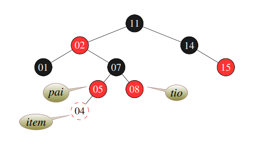
</p>

<strong>Correção:</strong> Faça o pai e o tio se tornarem pretos, o novo item na recursão (i.e., pai do pai) se torna vermelho. Reorganize os ponteiros um nível acima.<br>
<strong>Exemplo abaixo:</strong>
    
<p align="center">
  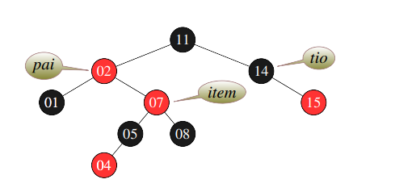
</p> 

Essa situação nos leva para o caso 2.
  </li>
  
  <li>
<strong>Situação:</strong> O tio de um item é preto, o item e seu pai são vermelhos e o item é o filho da direita.<br>

<p align="center">
  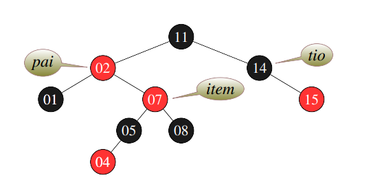
</p> 

<strong>Situação:</strong> O tio de um item é preto, o item e seu pai são vermelhos e o item é o filho da direita.<br>
<strong>Correção:</strong> Rotação para a esquerda a partir da posição do pai e do item.<br>

<p align="center">
  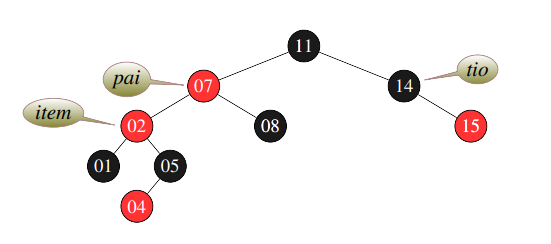
</p> 

Essa situação nos leva para o caso 3.
  </li>
  
  <li>
<strong>Situação:</strong> O tio do item é preto, o item e seu pai são vermelhos e o item é o filho da esquerda.<br>

<p align="center">
  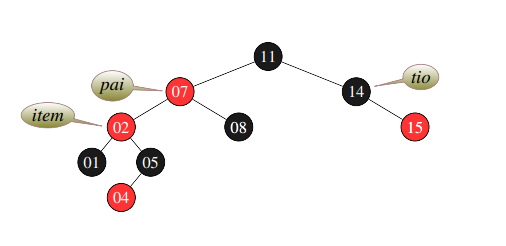
</p>

<strong>Situação:</strong> : O tio do item é preto, o item e seu pai são vermelhos e o item é o filho da esquerda.<br>
<strong>Correção:</strong> Modifique a cor do item do nível acima (11) e gere uma rotação a direita.<br>

<p align="center">
  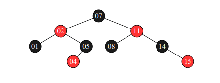
</p>

Observe que para atingir qualquer folha nessa estrutura, o número de nós pretos é o mesmo em todos os possíveis caminhos.
  </li>
</ol>

Pseudocódigo do método de inserção da árvore rubronegra:

```
RB-Insert(raiz, item)
begin
  insert(raiz, item) ; // inserção da arvore binária comum
  color[item] ←− RED;
  
  while item ̸= raiz and color[pai[item]] = RED do
    if pai[item] = esquerdo[pai[pai[item]]] then
      tio ←− direito[pai[pai[item]]];
      if color[tio] = RED then
        color[pai[item]] ←− BLACK ; // Caso 1
        color[tio] ←− BLACK ; // Caso 1
        color[pai[pai[item]]] ←− RED ; // Caso 1
        item ←− pai[pai[item]] ; // Caso 1
      
      else if item = direito[pai[item]] then
        item ←− pai[item] ; // Caso 2
        rotacaoSimplesEsquerda(raiz, item) ; // Caso 2
      color[pai[item]] ←− BLACK ; // Caso 3
      color[pai[pai[item]]] ←− RED ; // Caso 3
      rotacaoSimplesDireita(raiz, pai[pai[item]]) ; // Caso 3
    
    else
      código igual ao do if, só trocar as chamadas esquerda por direita
      
  color[raiz] ←− BLACK
```

Como conclusão do pelo método de inserção, temos que:

<ul>
  <li>A altura <i>h</i> de uma árvore vermelho-preta de <i>n</i> chaves é de no máximo <i>2log(n + 1)</i>.</li>
  <li>As buscas, inserções e remoções nessa estrutura apresentam caso médio de <i>O(log n)</i></li>
  <li>Sua vantagem, em comparação com a AVL, está na necessidade de uso, somente, de rotações simples à esquerda e à direita. Como pode ser observado, quando as rotações são chamadas, a função é corrigir alguma quebra de propriedade relacionada às cores de cada nó.</li>
</ul>

Sobre o método de remoção da árvore rubronegra temos que:

<ul>
  <li>A eliminação, como as demais operações da RedBlack, tem custo computacional de <i>O(log n)</i></li>
  <li>O algoritmo de remoção da árvore rubronegra é de forma análoga ao algoritmo de remoção de uma árvore binária padrão.</li>
  <li>A correção é realizada por 4 casos e é executada ao final do processo de remoção do nó na árvore.</li>
  <li>Diferente da inserção, observamos a cor do irmão do nó para decidir qual caso aplicar.</li>
  <li>Na remoção, se a ausência de um nó produzir um par de nós pretos, ou seja, um duplo preto, ai sim teremos problemas.</li>
</ul>

O que é preciso observar em uma remoção para que a árvore rubronegra se mantenhaem conformidade com suas propriedades? Tabela abaixo:

<table align="center">
  <tr>
    <td><strong>Caso</strong></td>
    <td><strong>Nó a ser removido</strong></td>
    <td><strong>Sucessor</strong></td>
  </tr>
  <tr>
    <td><strong>*1</strong></td>
    <td>Vermelho</td>
    <td>Único filho</td>
  </tr>
  <tr>
    <td><strong>2</strong></td>
    <td>Vermelho</td>
    <td>Vermelho</td>
  </tr>
  <tr>
    <td><strong>3</strong></td>
    <td>Preto</td>
    <td>Vermelho</td>
  </tr>
  <tr>
    <td><strong>*4</strong></td>
    <td>Preto</td>
    <td>Preto</td>
  </tr>
  <tr>
    <td><strong>5</strong></td>
    <td>Vermelho</td>
    <td>Preto</td>
  </tr>
</table>

<strong>Caso 1:</strong> Caso básico, em que o nó é vermelho e só possui um dos filhos.<br>
<strong>Caso 4:</strong>  Caso mais complicado, esse demanda correção da mesma forma que o aplicado no método de inserção, porém, utilizando 4 casos de aplicação/validação.

Como os casos funcionam:

<ol>
  <li>
O nó a ser removido é vermelho e possui apenas um único filho ounão possui filhos.<br>
<strong>Correção:</strong> Remoção análoga ao de uma árvore binária comum.
    
<p align="center">
  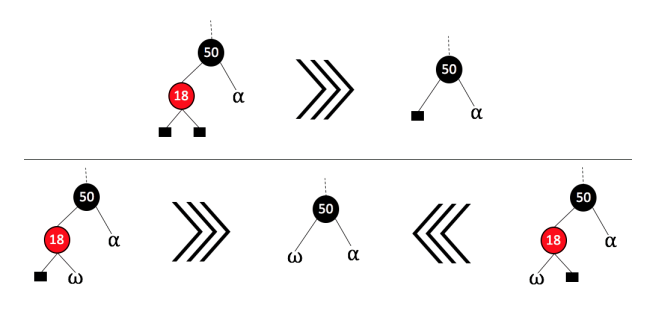
</p> 
  </li>
  
  <li>
O nó a ser removido é vermelho e seu sucessor também é vermelho.<br>  
<strong>Correção:</strong> Remoção análoga ao de uma árvore binária comum.

<p align="center">
  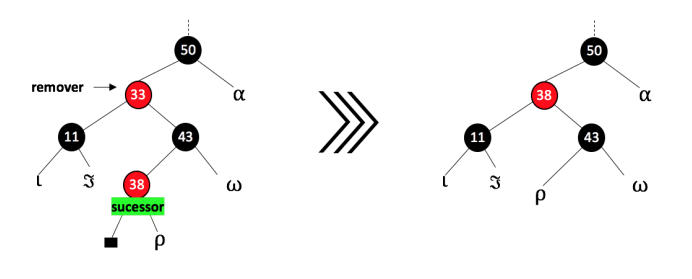
</p> 
  </li>
  
  <li>
O nó a ser removido é preto e seu sucessor é vermelho.<br>  
<strong>Correção:</strong> Remova o nó, substitua pelo sucessor e pinte o sucessor de preto.

<p align="center">
  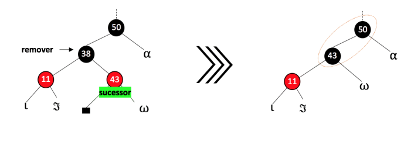
</p> 
  </li>
  
  <li>
O problema do duplo preto ocorre quando retiramos um nó preto. Como a árvore se baseia no número de pretos para validar suas propriedades, ela acaba tendo que compensar isso na remoção. Existem 4 casos a tratar quando o sucessor a ser removido é preto.

Para compreender o caso 4, considere a seguinte nomenclatura: <strong>z:</strong> o nó a ser removido; <strong>y:</strong> o sucessor de z; <strong>x:</strong> o filho do sucessor antes de qualquer modificação; <strong>w:</strong>  o irmão de x antes da remoção de z.

<ol>
  <li>
O irmão <i>w</i> de <i>x</i> é vermelho. Como <i>w</i> é vermelho, ambos os filhos são pretos, logo, deve-se trocar as cores de <i>w</i> e <i>x.pai</i> e realizar a rotação à esquerda tendo como ponto de observação <i>x.pai</i>.

Essas alterações não violam nenhuma propriedade da árvore. Contudo,
leva o Caso 4.1 para os demais casos citados.
  </li>
  
  <li>
O irmão <i>w</i> de <i>x</i> é preto e ambos os filhos de <i>w</i> são pretos, logo, deve-se atualizar <i>w</i> para vermelho, atualizar <i>x</i> levando-o para o seu pai e repetir o processo a partir do novo <i>x</i>. 
  </li>
  
  <li>
O irmão <i>w</i> de <i>x</i> é preto, o filho esquerdo de <i>w</i> é vermelho e o filho da direita é preto, logo, deve-se trocar a cor de <i>w</i> e de seu filho esquerdo, rotacionar a árvore para a direita usando como pivô <i>w</i>. Neste ponto, o novo irmão <i>w</i> de <i>x</i> é preto com o filho da direita na cor vermelha, o que nos leva ao próximo caso.
  </li>
  
  <li>
O irmão <i>w</i> de <i>x</i> é preto e o filho direito de <i>w</i> é vermelho, logo, deve-se rotacionar a árvore para a esquerda usando como pivô <i>x.pai</i>, <i>w</i> é pintado com a cor de <i>x.pai</i>, <i>x.pai</i> é pintado de preto e pinta o filgo direito de <i>w</i> de preto.
  </li> 
</ol>
  </li>
  
  <li>
O nó a ser removido é vermelho e x, irmão de sucessão, é preto, logo, deve-se pintar o <i>x</i> de vermelho e resolver os problemas pelos casos particulares do caso 4.
  </li> 
</ol>

Pseudocódigo do método de remoção:

```
RB-TRANSPLANT(T,u,v){
  if u.p == T.nil
    T.root = v
  else if u == u.p.left
    u.p.left = v
  else u.p.right == v
    v.p = u.p
}

RB-DELETE-FIXUP(T,x){
  while x!= T.root and x.color == BLACK
    if x == x.p.left
      w = x.p.right
      if w.color == RED
        w.color = BLACK
        x.p.color = RED
        LEFT-ROTATE(T,x,p)
        w = x.p.right
      if w.left.color == BLACK and w.right.color == BLACK
        w.color = RED
        x = x.p
      else if w.right.color == BLACK
        w.left.color = BLACK
        w.color = RED
        RIGHT-ROTATE(T,w)
        w = x.p.right
      w.color = x.p.color
      x.p.color = BLACK
      w.right.color = BLACK
      LEFT-ROTATE(T,x,p)
      x = T.root
    else(same as then clause with "right" and "left" exchanged)
  x.color = BLACK
}

RB-DELETE(T,z){
  y = z
  y-original-color = y.color
  if z.left == T.nil
    x = z.right
    RB-TRANSPLANT(T,z,z.right)
  else if z.right == T.nil
    x = z.left
    RB-TRANSPLANT(T,z,z.left)
  else y = TREE-MINIMUM(z.right)
    y-original-color = y.color
    x = y.right
    if y.p == z
      x.p = y
    else RB-TRANSPLANT(T,y,y.right)
      y.right = z.right
      y.right.p = y
    RB-TRANSPLANT(T,z,y)
    y.left = z.left
    y.left.p = y
    y.color = z.color
  if y-original-color == BLACK
    RB-DELETE-FIXUP(T,x)
}
```

## Funcionamento da aplicação

Após as estruturas para comparação serem implementadas, foram feitas funções para que haja a inserção dos diferentes tipos de arquivos nas estruturas, onde o usuário irá escolher entre os arquivos de 500, 5000, 50000 e 500000 inserções. Após ele escolher, o programa irá executar em todas as estruturas uma após a outra, retornando o tempo gasto para inserção e remoção, se existirem, dos outros 10000 elementos aleatórios.

O arquivo <code>main.cpp</code> ficou da seguinte forma:

```C++
string selectTextFile();
void execute_Binary_Tree(string f);
void execute_AVL_Tree(string f);
void execute_RB_Tree(string f);
void execute_umap(string f);
void execute_map(string f);
void execute_binarySearch(string f);

int main(){
	string textFile = selectTextFile();

	execute_Binary_Tree(textFile);
	execute_AVL_Tree(textFile);
	execute_RB_Tree(textFile);
	execute_umap(textFile);
	execute_map(textFile);
	execute_binarySearch(textFile);

	return 0;
}

string selectTextFile(){
	string file1 = "text_files/randomNumbers_500.txt";
	string file2 = "text_files/randomNumbers_5000.txt";
	string file3 = "text_files/randomNumbers_50000.txt";
	string file4 = "text_files/randomNumbers_500000.txt";

	int option = -1, cancel = -1;

	cout << endl << "Para selecionar o arquivo com 500 números aleatórios, digite 1." << endl;
	cout << "Para selecionar o arquivo com 5000 números aleatórios, digite 2." << endl;
	cout << "Para selecionar o arquivo com 50000 números aleatórios, digite 3." << endl;
	cout << "Para selecionar o arquivo com 500000 números aleatórios, digite 4." << endl << endl;

	while(cancel != 0){
		cout << "Opção: ";
		cin >> option;

		if(option == 1){
			cancel = 0;
			return file1;
		}
		else if(option == 2){
			cancel = 0;
			return file2;
		}
		else if(option == 3){
			cancel = 0;
			return file3;
		}
		else if(option == 4){
			cancel = 0;
			return file4;
		}
		else{
			cout << "Opção inválida, digite novamente." << endl;
		}
	}

	return file1;
}

void execute_Binary_Tree(string f){
	binary_Tree *raiz = CreateTree_binary();
	Record_binary_tree r;
	insertElements_binary_tree(&raiz, r, f);
	searchAndRemoveElements_binary_tree(&raiz, r);
}

void execute_AVL_Tree(string f){
	avl_Tree *raiz = CreateTree_avl();
	Record_avl_tree r;
	insertElements_avl_tree(&raiz, r, f);
	searchAndRemoveElements_avl_tree(&raiz, r);	
}

void execute_RB_Tree(string f){
	Tree_rb *raiz = CreateTree_rb();
	Record_rb r;
	insertElements_rb(&raiz, r, f);
	searchAndRemoveElements_rb(&raiz, r);
}

void execute_umap(string f){
	unordered_map <string, float> u_map;
	insertAndSearchElements_umap(u_map, f);
}

void execute_map(string f){
	map <string, float> map;
	insertAndSearchElements_map(map, f);
}

void execute_binarySearch(string f){
	insertAndSearchElementsWithBinarySearch(f);
}
```

No terminal, irá aparecer para o usuário da seguinte forma:

<p align="center">
  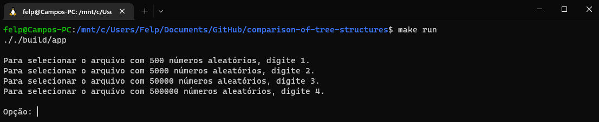
</p> 

O usuário irá selecionar a opção que deseja, o programa irá executar as estruturas e retornar o tempo de cada uma para ele.

<p align="center">
  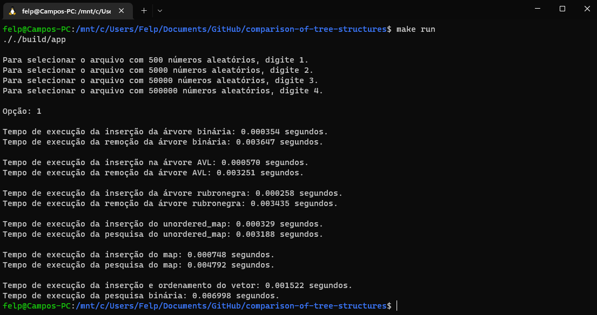
</p> 

## Resultados

Para a obtenção dos resultados, foram feitos cinco testes para todas as estruturas, que foram salvas no arquivo <code>.xlsx</code>. Para acessar, clique <a href="https://github.com/fco3lho/comparison-of-tree-structures/blob/main/times_table.xlsx">aqui</a>.

A média dos tempos de execução foram as seguintes:

<ul>
<li>
Para 500000 inserções: 
	

</li>
	
<li>
Para 50000 inserções:


</li>

<li>
Para 5000 inserções:


</li>
		
<li>
Para 500 inserções:

	
</li>
		
<li>
Para a inserção de 5000 elementos ordenados:


</li>
</ul>

Ignorando os valores obtidos com a pesquisa binária, por ser muito discrepante e adotando-o apenas na lista ordenada por ficar muito parecido com a árvore de pesquisa binária, temos os seguintes gráficos (todos os gráficos tratam o tempo em segundos):

<ul>
<li>Para arquivo de texto com 500000 elementos:


</li>

<li>Para arquivo de texto com 50000 elementos:


</li>

<li>Para arquivo de texto com 5000 elementos:


</li>

<li>Para arquivo de texto com 500 elementos:


</li>

<li>Para arquivo de texto com 5000 elementos ordenados:


</li>
</ul>

## Conclusão

Sendo assim, a partir dos valores extraídos e dos gráficos feitos, é de melhor visualização o poder das estruturas de dados usadas. Podemos ver que para valores aleatórios e para grandes entradas de dados, as estruturas de árvore tem muita diferença entra si, mas mesmo com pouca diferença, a árvore rubronegra leva vantagem sobre a árvore AVL e árvore de busca binária na inserção.

Na remoção, as árvores ficaram bem equiparadas e quem levou vantagem sobre as outras estruturas foi o <code>unordered_map</code>, se tratando também de uma árvore rubronegra, que, pelo que parece é melhor otimizada do que a estrutura criada no repositório.

O <code>map</code>, se tratando de uma tabela hash, também se comportou bem, ficando atrás das estruturas de árvore, mas mesmo assim, se equiparando minimamente em inserção e remoção.

A <strong>pesquisa binária</strong> perdeu em todos os quesitos com muita discrepância por ser muito caro para grandes entradas de dados.

Com os resultados iniciais, pareceu um pouco entranho a árvore binária de pesquisa estar se equiparando à AVL e rubronegra, então foi criada um arquivo de texto com 5000 elementos ordenados para ser feita a inserção, e neste ponto foi possível observar o custo real das estruturas de árvore, onde o pior caso das árvores <strong>binária</strong>, <strong>AVL</strong> e <strong>rubronegra</strong> são, respectivamente, <i>O(n)</i>, <i>O(log n)</i> e <i>O(log n)</i>, fazendo com que a árvore binária tenha se equiparado com a pesquisa binária no método de inserção e tenha perdido com muita discrepância até para a pesquisa binária no método de remoção, se mostrando uma péssima escolha para tratamento de grandes entradas de dados.

## Configuração utilizada

<table align="center">
	<tr>
		<td><strong>Processador</strong></td>
		<td>AMD Ryzen 7 5700U - Octa-core - 4.3GHz</td>
	</tr>
	<tr>
		<td><strong>Memória RAM</strong></td>
		<td>(4GB + 16GB) - 3200MHz</td>
	</tr>
	<tr>
		<td><strong>GPU</strong></td>
		<td>AMD Radeon Graphics - 2GB - 1.9GHz</td>
	</tr>
	<tr>
		<td><strong>Sistema Operacional</strong></td>
		<td>Linux Ubuntu 22.04.1</td>
	</tr>
</table>

## Compilação e Execução

O repositório possui um arquivo <i>Makefile</i> que realiza todo o procedimento de compilação e execução. Para tanto, temos as seguintes diretrizes de execução:

<table align="center">
  <tr>
    <td><strong>Comando</strong></td>
    <td><strong>Função</strong></td>
  </tr>
  <tr>
    <td><code>make clean</code></td>
    <td>Apaga a última compilação realizada contida na pasta build.</td>
  </tr>
  <tr>
    <td><code>make</code></td>
    <td>Executa a compilação do programa utilizando o g++, e o resultado vai para a pasta build.</td>
  </tr>
  <tr>
    <td><code>make run</code></td>
    <td>Executa o programa da pasta build após a realização da compilação.</td>
  </tr>
</table>

## Contatos

<div align="center"> 
  <a href="https://www.instagram.com/fco3lho/" target="_blank"></a>
  <a href = "mailto:felipecampos50123@gmail.com"></a>
  <a href="https://www.linkedin.com/in/fco3lho/" target="_blank"></a>
